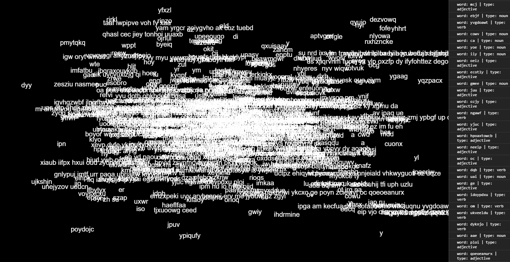
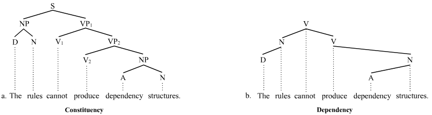
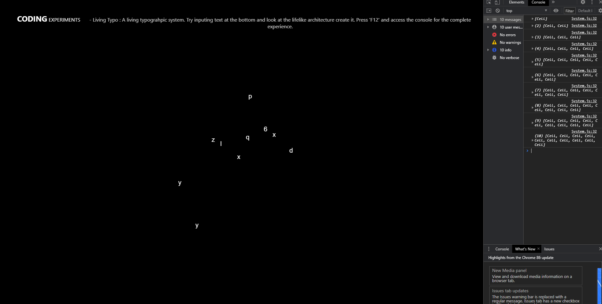
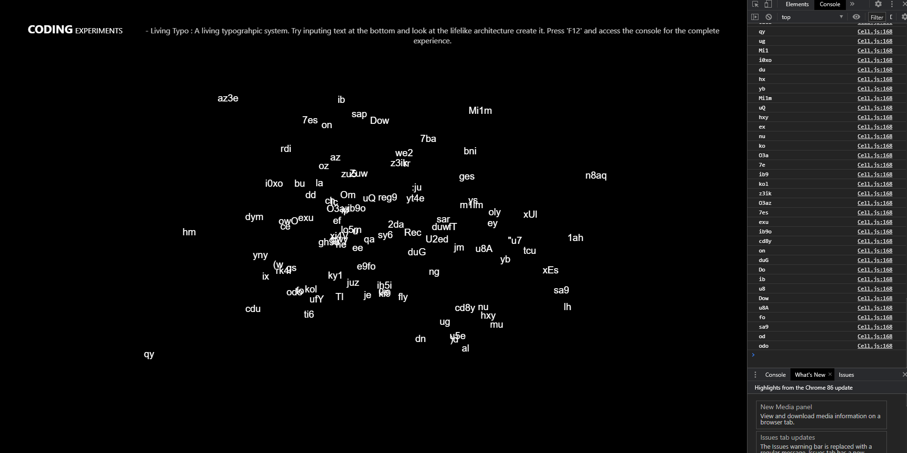
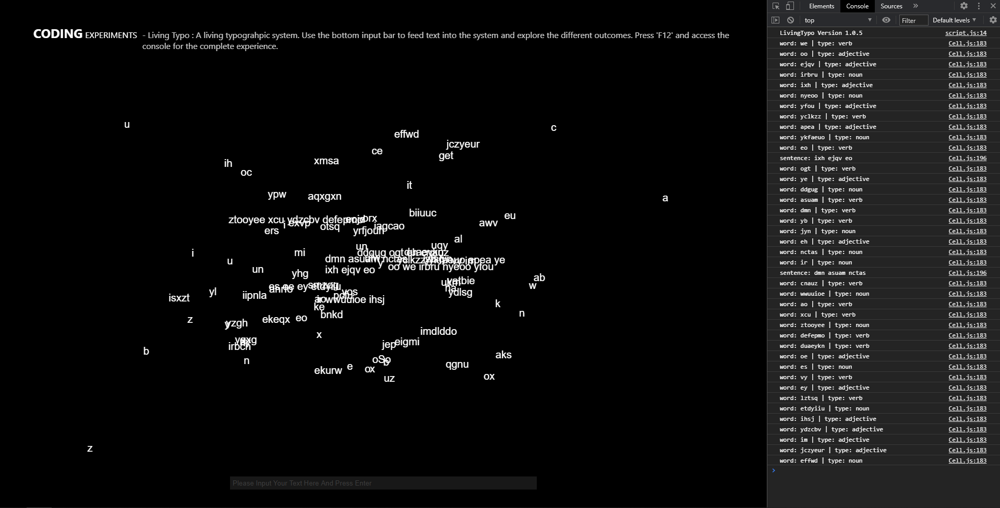
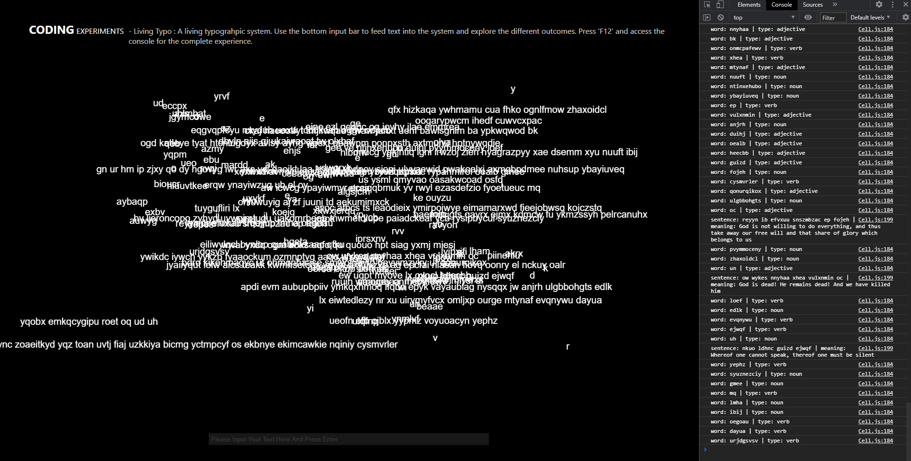
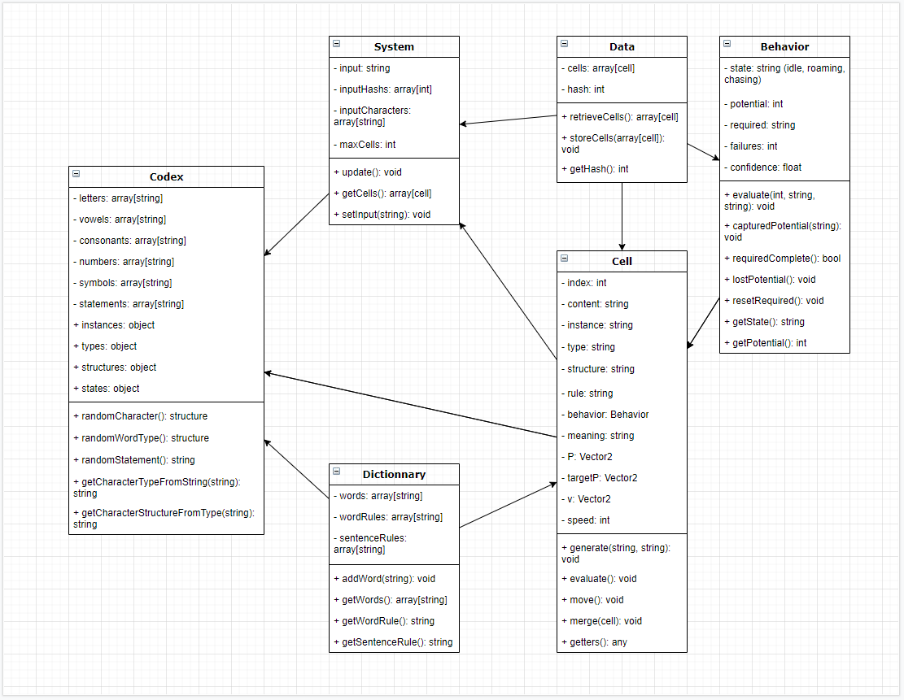

# Living Typo

> Build version **_1.0.6_**

> Last update November 23, 2020;

_Living Typo is an organic typographic system that explores the creative capacity of the growing Artificial Intelligence technology and other future programmed generative structures._

_This project is based on my own interpretation of a machine-learning algorithm and thus probably doesn't feel as mature as a fully developed AI._

## Roadmap

Inspiration from Dina Kelberman and her web poems. Enjoyed the code interactivity with the HTML and the moving images/colors on screen. It got me thinking about an interactive living entity that generates text and uses the console to output the information. [Poems](https://dinakelberman.com/#webpoems)

The first thing I did was to explore a few basic rules and structures of the English language and find a relevant typographic methadology applicable for my algorithm.



I thought about transforming my work into a sentence creator, where instead of generating its own structures and words, it would reproduce existing English words and try to construct sentences from it. But after reflexion, I decided to keep it the way it is as it emphasizes the creative process of AI technology.

I then did a bit of research about human behaviors and quickly realized that, being time restricted, I couldn't go too far in the development of a complete behavior. Therefore, I restrained my behaviors to the concept of confidence and failures, which is something strongly seen in the human interactivity. These were some of the rules I came up with :

``` javascript
/**
 * How to establish rules for the moving states of the cells?
 * less confident = more roaming
 * more roaming = less search
 * more failures = less confident
 * find potential = decrease failures
 * more failures = less strict on required
 * potential loss = decrease in confidence
 * randomly found = increase confidence a bit and merge
 */
```

I couldn't establish them all as it turned out being more complex than it sounds, but basically an entity will be more active and search for potential love more often when confident. But if their potential gets stolen, their confidence decreases and they will become less and less active. They gain some confidence when they merge with their potential.

Some interesting results that came out of this behavioral system that I didn't think about, is that the more advanced an entity is, the harder it is to find love. This eventually makes it low on confidence and unintentionally, this has created an outcome similar to the aging process, where the older a person gets the less active they become.





During the peer review, I got recommended to remove the numbers and symbols because, even at a low rate of spawning, they were making it weird and too alienating. So I did remove them.

This is where I started tackling the user input. My first idea was to have the user write down some text and the system would try its best to recreate it. However, considering the complexity and time required for this task, I decided to that the input field would only serve as a way to feed the system with your own characters. Thus keeping the interactivity while also being able to modulate the outcome of the system.



I thought about adding a random definition for each word, but I couldn't find any effective ways of doing so. So instead, I decided to translate each sentence into random philosophical statements to vaguely associate the newly created language with the English vocabulary while making it more humoristic.



After letting my AI work for a bit, I realized that at some point some of the entities' confidence would reach 0 and they would completely abandon every hope of finding a potential, leaving their number of failures to grow infinitely. This brought the idea of implementing crippling depression and suicide as part of the system as we see it with human life, thus giving a cruel sense to my work.

Nevermind, I ended up simply adjusting the exponential function so that even if they hit 0 confidence there is still hope for them to find their potential.



_Fun Fact : The sentences look like incomprehensible Star Wars dialogues or, in a more human view, ritual sayings from native people or when trying to chase paranormal entities._

---

## Tools

- p5.js -> [p5 Homepage](https://p5js.org/reference/#content)
- Draw IO -> [Draw.io Homepage](https://app.diagrams.net/)

:metal: Huge thanks to all the developers behind these amazing tools. :metal:

---

## References

- [Basic English Grammar Rules](https://www.englishclub.com/grammar/rules.htm)
- [Sentence Structure](https://en.wikipedia.org/wiki/Phrase_structure_rules#:~:text=Phrase%20structure%20rules%20are%20a,by%20Noam%20Chomsky%20in%201957.&text=A%20grammar%20that%20uses%20phrase,type%20of%20phrase%20structure%20grammar)
- [Human Behavior](https://en.wikipedia.org/wiki/Human_behavior)
- [Average Sentence Length](https://www.enago.com/academy/how-to-optimize-sentence-length-in-academic-writing/#:~:text=Appropriate%20Sentence%20Length&text=Try%20to%20keep%20the%20average,or%20the%20nature%20of%20writing)
- [Philosophical Quotes](https://www.philosophybasics.com/general_quotes.html)

---

## Team

**Xavier Champoux**
Programmer
[Website](https://levieuxsinge.github.io/portfolio/) |
[Instagram](https://www.instagram.com/doldmk/?hl=fr) |
[ArtStation](https://www.artstation.com/doldmnk)

> :postbox: **Contact Us** through our social medias.

---

## License

- Free
- © Xavier Champoux 2020
